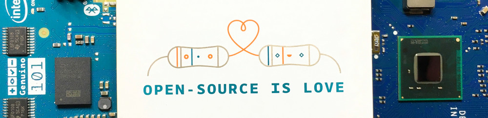

# IoT-DevKit

IoT开发工具箱：收纳整理IoT开发中可能会用到的、可复用的一些库和配置等。

原有的分散的仓库全部删除，其内容全部转移到本仓库。由于这些工具提交后几乎从未修改，可以认为是处于归档状态，因此不保留旧仓库的提交修改记录，仅记录首次提交日期。

2019年9月15日整理。

**注意：提交前必须对敏感信息脱敏。**

## 已存档项目

这里保存那些已经做成、在用的，并且不会频繁更新、无需纳入版本控制的玩具项目。

|仓库|首次提交日期|
|----|----|
|ESP-Thermometer|2019-02-28|
|Humidifier|2017-11|

## 配置文件

|仓库|首次提交日期|
|----|----|
|Galileo-Configuration|2019-01-20|

## 器件驱动

|仓库|首次提交日期|
|----|----|
|BME280-I2C-Linux-Driver|2017-01-13|
|LCD1602-I2C-Driver|2017-02-16|
|SSD1306-I2C-Linux-Driver|2017-02-23|
|ST7920-12864|2017-10-21|

## 算法工具库

|仓库|首次提交日期|
|----|----|
|Lunar-Calendar|2017-10-21|
|NMEA0183-Parser|2017-10-31|

## 有关版权问题

每个子仓库的版权问题均单独说明。
